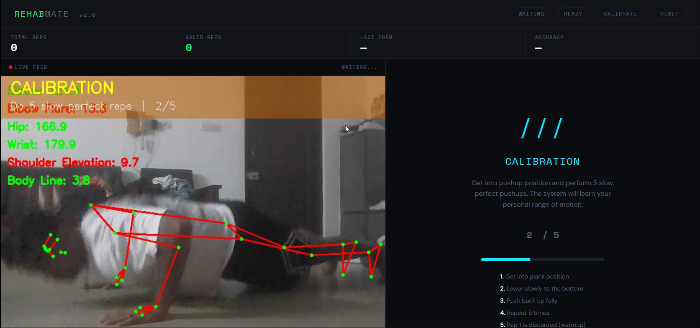
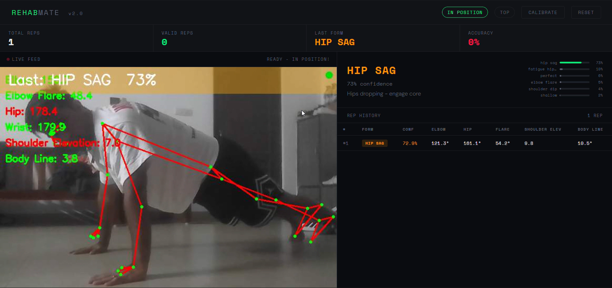
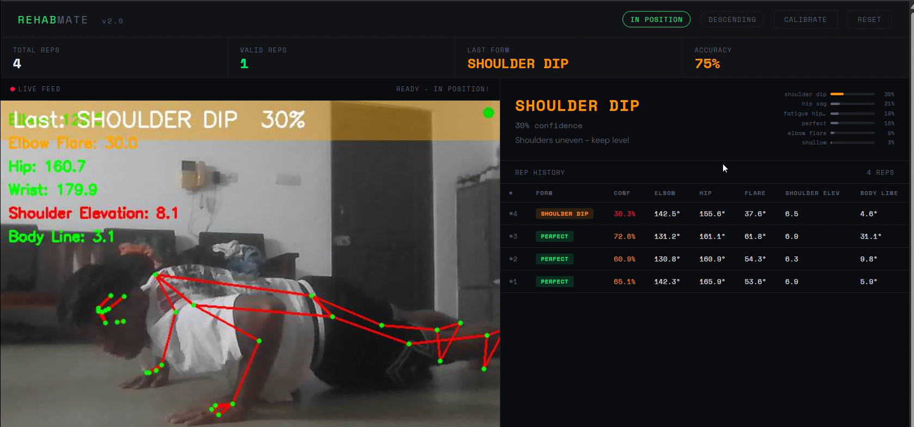
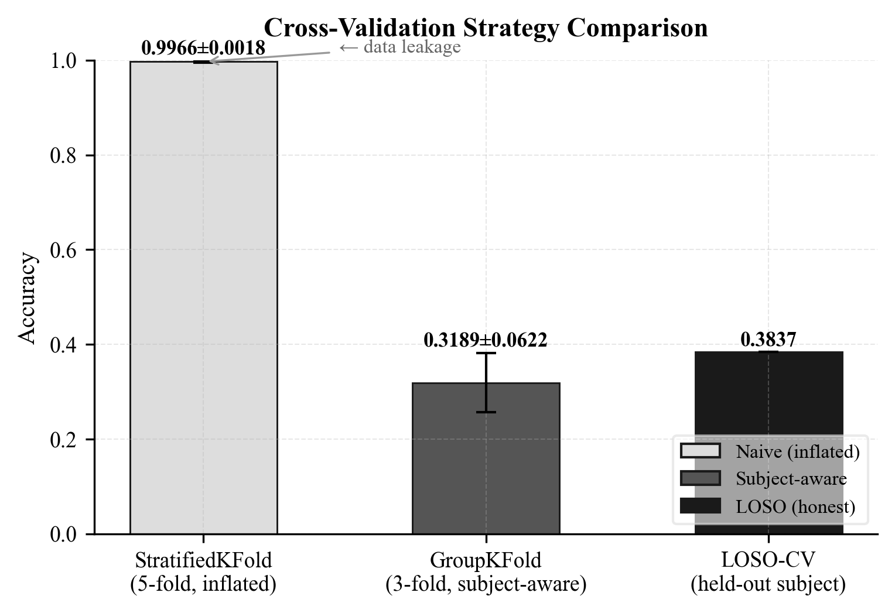

<div align="center">

<h1>🏋️ RehabMate</h1>

<p><strong>A Subject-Aware Push-Up Rehabilitation System with Personalised Calibration, Temporal Leakage-Free Feature Engineering, and Adaptive Hardware Design</strong></p>

<p>
  <a href="#"></a>
  <a href="#"></a>
  <a href="#"></a>
  <a href="#"></a>
  <a href="#"></a>
  <a href="#"></a>
</p>

<p><em>SRM Institute of Science and Technology — Department of Computational Intelligence<br>VI Semester Minor Project | IEEE Paper Under Submission</em></p>

</div>

---

> **This is not a push-up counter.** It is a subject-aware form classification system that demonstrates a 62 percentage-point accuracy inflation in prior push-up evaluation work, introduces a temporal leakage-free feature accumulation pipeline, and integrates personalised per-user calibration — validated on 13 subjects, 11,237 frames, 6 form classes.

---

## 📌 The Problem With Every Other Push-Up System

Every published push-up classification paper reports accuracy in the **82–99% range**. RehabMate reproduces those numbers — and then shows exactly why they are wrong.

| Evaluation Protocol | Accuracy |
|---|---|
| StratifiedKFold (naive — what everyone uses) | **99.6% ± 0.0019** |
| StratifiedGroupKFold (subject-level hold-out) | **35.7% ± 0.1164** |
| LOSO-CV (leave-one-subject-out) | **37.17%** |

The same model. The same data. The same weights. **62 percentage points of difference — from evaluation design alone.**

When a model is trained on frames from Person A and tested on frames from Person A, it partially recognises them rather than purely classifying their form. StratifiedKFold does not prevent this. Explicit subject-level hold-out does. No prior push-up classification paper has documented this gap.

---

## 📸 Screenshots

### Calibration Phase
*System learns your personal range of motion over 5 reps before any classification begins.*


### Form Detection — Hip Sag
*73% confidence hip sag detection with live joint angles, probability bars, and rep history table.*


### Full Dashboard — Mixed Session
*3-rep session showing rep 1 classified as hip_sag, reps 2 and 3 as perfect — with exact joint angles logged per rep.*


> More screenshots coming — elbow flare, shoulder dip, and shallow detection.

---

## ✨ What Makes This Different

### 1. Subject-Aware Evaluation Protocol
StratifiedGroupKFold with subject identity as the grouping key throughout — model selection, hyperparameter optimisation (100 Optuna trials), and final reporting. The 68.7% test set accuracy is the **first honest cross-subject benchmark** for 6-class push-up form classification in the literature.

### 2. Temporal Leakage Elimination
Cumulative repetition statistics are computed using expanding `cummin()`/`cummax()` operators — not `groupby.transform()`. The distinction matters: `transform()` broadcasts the final-rep minimum to all frames, meaning frame 1 already "knows" the minimum angle reached at frame 50. This is future data leakage. An ablation confirms a **4.1pp accuracy degradation** when the leaky approach is used.

### 3. Personalised Calibration
A 5-repetition calibration phase at session start computes per-user feature offsets before any inference runs. The primary validation participant produced a **37.45° elbow flexion offset** versus population mean — demonstrating why population-level normalisation fails for cross-user deployment.

### 4. Documented Negative Finding
The soft-voting ensemble (LightGBM w=3, Random Forest w=2) achieves **61.9%** — 6.8 points below Random Forest alone. LightGBM's leaf-wise tree growth allows it to memorise subject-specific movement signatures during training, which hurts it when test subjects are entirely held out. This divergence is invisible under naive StratifiedKFold. It is documented as an explicit finding rather than buried.

### 5. Integrated Hardware Design
A scissor-lift platform driven by a linear actuator with FSR-402 force-sensitive resistors delivers adaptive mechanical support proportional to exercise progression `P = (θ − θ_min)/(θ_max − θ_min)`. A **3D scaled prototype** demonstrates the mechanical movement concept. Full integration is planned for the major project extension.

---

## 🏗️ Architecture

```
Webcam (30 FPS)
    │
    ▼
┌─────────────────────────────────────────────────────────┐
│  Camera Reader Thread  │  cv2.grab() — drains OS buffer  │
└─────────────┬───────────────────────────────────────────┘
              │ latest_frame
              ▼
┌─────────────────────────────────────────────────────────┐
│  Processing Thread (~12 FPS)                            │
│                                                         │
│  PoseAnalyzer          → 33 landmarks (10-frame smooth) │
│  ExerciseDetector      → position gate (4 conditions)  │
│  PushupStateMachine    → 6-state FSM + rep counter      │
│  UserCalibration       → per-subject offset computation │
│  FeatureEngineer       → 21 features (causal cummin)    │
│  LGBMPushupClassifier  → soft vote 3:2 → 6 classes      │
└─────────────┬───────────────────────────────────────────┘
              │                         │
              ▼                         ▼
┌─────────────────────┐    ┌─────────────────────────────┐
│  Flask Server Thread │    │  ESP32 (Hardware Design)    │
│  MJPEG + REST API    │    │  Linear Actuator + FSR-402  │
│  :5000               │    │  UART 115200 baud           │
└──────────────────────┘    └─────────────────────────────┘
```

### FSM State Transitions
```
READY ──[θe<160, v<-5°/s]──▶ DESCENDING ──[θe<θ_bottom]──▶ BOTTOM
  ▲                                                              │
  │                                                    [t>50ms, v>3°/s]
  │                                                              ▼
REST ◀──[t>3s]── TOP ◀──[θe>θ_top]── ASCENDING ◀──────────────┘
                  │
            [t>150ms, v<-5°/s]
                  └──▶ DESCENDING (next rep)
```

---

## 📊 Results

### Cross-Validation Comparison (Primary Finding)



```
StratifiedKFold    ████████████████████████████████████ 99.6% ± 0.002  ← INFLATED
GroupKFold (LGB)   ████████████                         29.1% ± 0.062  ← honest
GroupKFold (RF)    █████████████                        35.7% ± 0.116  ← honest
LOSO-CV            █████████████                        37.2%          ← strictest
```

### Model Performance (Subject-Aware)

| Metric | LightGBM | Random Forest |
|---|---|---|
| Optuna Best CV (SGK) | 0.4469 | **0.4604** |
| Test Set Accuracy | 0.6051 | **0.6871** |
| GroupKFold CV | 0.2913 ± 0.0623 | **0.3567 ± 0.1164** |
| Ensemble (soft 3:2) | 0.6187 | — |

> ⚠️ **Negative Finding:** Ensemble underperforms RF by 6.8pp. Deployment model is RF.

### SHAP Feature Importance (Top 3)

| Feature | Mean \|SHAP\| | Biomechanical Meaning |
|---|---|---|
| `elbow_cum_max` | 1.277 | Maximum descent depth across the rep |
| `hip_cum_min` | 0.812 | Minimum hip stability during the rep |
| `hip_rel` | 0.632 | Postural alignment relative to user's own baseline |

The model learns biomechanically meaningful patterns — not subject identity proxies.

### 6-Class Confusion Matrix (LOSO-CV)

```
             elbow  fatigue  hip    perfect  shallow  shoulder
             flare  hip_sag  sag             dip
elbow_flare  1.1%   3.5%    9.1%   56.9%   3.3%     26.1%
fatigue_sag  1.4%   0.8%   26.0%   33.9%   3.2%     34.7%
hip_sag      2.1%   7.1%   21.3%   54.5%   1.6%     13.4%
perfect      2.8%   2.5%    7.8%   60.9%   1.5%     24.5%
shallow      0.0%  16.7%    1.7%   53.6%   4.8%     23.2%
shoulder_dip 1.2%   3.8%   12.1%   57.6%   1.5%     23.9%
```

Systematic collapse toward `perfect` across all classes — caused by inter-subject anatomical variation, not model architecture failure. This is what StratifiedKFold conceals.

---

## 📥 Download Trained Model

The trained model (`rehabmate_v3.pkl`, 33MB) is hosted on Google Drive due to GitHub file size limits.

> **[⬇️ Download rehabmate_v3.pkl from Google Drive](YOUR_GDRIVE_LINK_HERE)**

Place it in the root `RehabMate/Model/` directory before running `app.py`.

---

## 🗂️ Repository Structure

```
RehabMate/
│
├── ── Core Application ──────────────────────────────────────────
├── app.py                    # Flask app — 3-thread architecture
├── pose_analyzer.py          # MediaPipe BlazePose + temporal smoothing
├── exercise_detector.py      # Position gating (4 conditions)
├── state_machine.py          # 6-state FSM + rep counter
├── user_calibration.py       # 5-rep calibration + per-subject offsets
├── lgbm_classifier.py        # LightGBM + RF ensemble + SHAP
│
├── ── Training & Evaluation ─────────────────────────────────────
├── train_pipeline.py         # Optuna HPO + StratifiedGroupKFold training
├── loso_cv.py                # Leave-One-Subject-Out evaluation
├── stratified_cv.py          # CV strategy comparison (3 protocols)
├── collect_data.py           # Data collection with subject labelling
├── plot_rehabmate.py         # Generates paper figures (CV bar, SHAP, CM)
│
├── ── Dataset ───────────────────────────────────────────────────
├── pushup_data_clean.csv     # 11,237 frames, 13 subjects, 6 classes
│
├── ── Figures ───────────────────────────────────────────────────
├── paper_figures/            # CV comparison, confusion matrix, SHAP plots
│
├── ── UI ────────────────────────────────────────────────────────
├── templates/
│   └── index.html            # Browser dashboard
│
├── ── Assets ────────────────────────────────────────────────────
├── assets/
│   ├── ss_calibration.png    # Calibration phase — 5-rep setup
│   ├── ss_hip_sag.png        # Hip sag detection at 73% confidence
│   ├── ss_dashboard.png      # Full dashboard — mixed session rep history
│   └── cv_comparison.png     # CV strategy comparison bar chart
│
├── requirements.txt
├── .gitignore
└── README.md

── Not in repo (Google Drive) ────────────────────────────────────
rehabmate_v3.pkl              # 33MB — trained deployment model
pushup_balanced.csv           # 2.1MB balanced training set
pushup_data_v2.csv            # 1.2MB expanded dataset
```

---

## ⚙️ Setup

```bash
git clone https://github.com/aadvikmazumdar/RehabMate.git
cd RehabMate
```

**Download the trained model from Google Drive and place it here:**
```
RehabMate/rehabmate_v3.pkl
```

**Install dependencies:**
```bash
pip install -r requirements.txt
```

### Run

```bash
python app.py
```

Open `http://localhost:5000` in your browser. On first launch the system enters calibration mode automatically — perform 5 slow correct push-ups. Offsets are saved to `calibration_profile.json` and applied to all subsequent sessions.

### Train from scratch

```bash
# Collect your own data
python collect_data.py

# Train with Optuna HPO + StratifiedGroupKFold (100 trials)
python train_pipeline.py

# Run LOSO-CV evaluation
python loso_cv.py

# Generate paper figures (CV comparison, SHAP, confusion matrix)
python plot_rehabmate.py
```

---

## 📋 Requirements

```
mediapipe>=0.10.0
opencv-python>=4.8.0
flask>=3.0.0
lightgbm>=4.0.0
scikit-learn>=1.3.0
optuna>=3.4.0
shap>=0.44.0
numpy>=1.24.0
pandas>=2.0.0
```

---

## 🔬 Technical Details

### Feature Engineering Pipeline (21 features)

| Group | Features | Method |
|---|---|---|
| Raw Angles (5) | θe, θf, θh, s, β | Direct from smoothed landmarks |
| Dynamics (3) | ve, vh, tphase | 10-frame sliding window |
| Temporal Drift (3) | Δe, Δh, v̄_trend | Exponential moving average |
| Relative (2) | erel, hrel | Angle minus calibration offset |
| Interaction (2) | θh/θe, β−(180−θh) | Dimensionless ratios |
| **Cumulative Rep (6)** | **e_min, e_max, e_range, h_min, h_max, h_range** | **Causal cummin/cummax** |

### Why Causal Accumulation Matters

```python
# ❌ WRONG — temporal leakage
df['elbow_min'] = df.groupby('rep_id')['elbow'].transform('min')
# frame 1 already knows the minimum elbow angle reached at frame 50

# ✅ CORRECT — causal accumulation
df['elbow_min'] = df.groupby('rep_id')['elbow'].expanding().min().values
# frame t only knows frames 0 through t

# Measured accuracy impact: 4.1pp degradation with leaky approach
```

### Calibration Offsets (Subject 11011)
```
elbow_flexion:     -37.45°   (largest offset — confirms population mean fails)
hip_alignment:      +1.31°
body_line:          +8.22°
elbow_flare:        -1.75°
shoulder_elevation: -1.02°
```

---

## 🩺 6 Form Classes

| Class | Description | Frames |
|---|---|---|
| `perfect` | Correct form | 5,244 |
| `shoulder_dip` | Asymmetric shoulder height | 2,644 |
| `hip_sag` | Sagging hip alignment | 1,460 |
| `fatigue_hip_sag` | Progressive sag from fatigue | 651 |
| `elbow_flare` | Excessively wide elbow angle | 635 |
| `shallow` | Insufficient descent depth | 603 |
| **Total** | | **11,237** |

---

## 🔩 Hardware Design

> Current deliverable: **3D scaled scissor-lift prototype** demonstrating vertical range-of-motion concept. Full hardware integration (ESP32 + actuator + FSR) planned for major project extension.

```
Assistive control formula:
P = (θ − θ_min) / (θ_max − θ_min)        ← progression [0,1]
h_target = h_min + P × (h_max − h_min)   ← platform height

Fatigue detection:
Fatigue(n) = 1  if  θ̄_h(n) − θ̄_h(1:3) < −15°
                AND  v̄(n) < 0.7 × v̄(1:3)
           = 0  otherwise
```

| Component | Specification | Status |
|---|---|---|
| Scissor-Lift | h = L·sin(θ), designed for ≥80kg | 3D Model Built |
| Linear Actuator | 12V, stroke ≥150mm | Design Spec |
| ESP32 | UART 115200 baud, PWM + ADC | Design Spec |
| FSR-402 ×2 | F = (Vout·Rref)/(Vcc−Vout)·kFSR | Design Spec |


---

## 👥 Team

| Name | Role |
|---|---|
| Paul V Mathew | Hardware architecture, hardware design, |
| Aadvik Mazumdar | Software architecture, ML pipeline, data collection |

---
